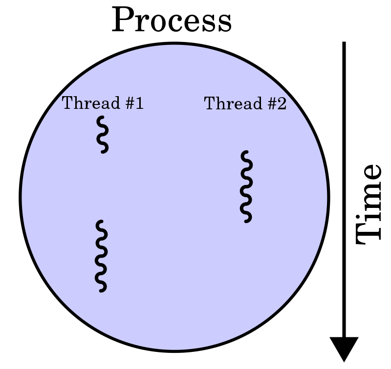
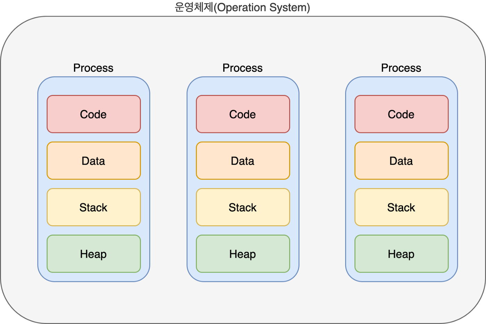
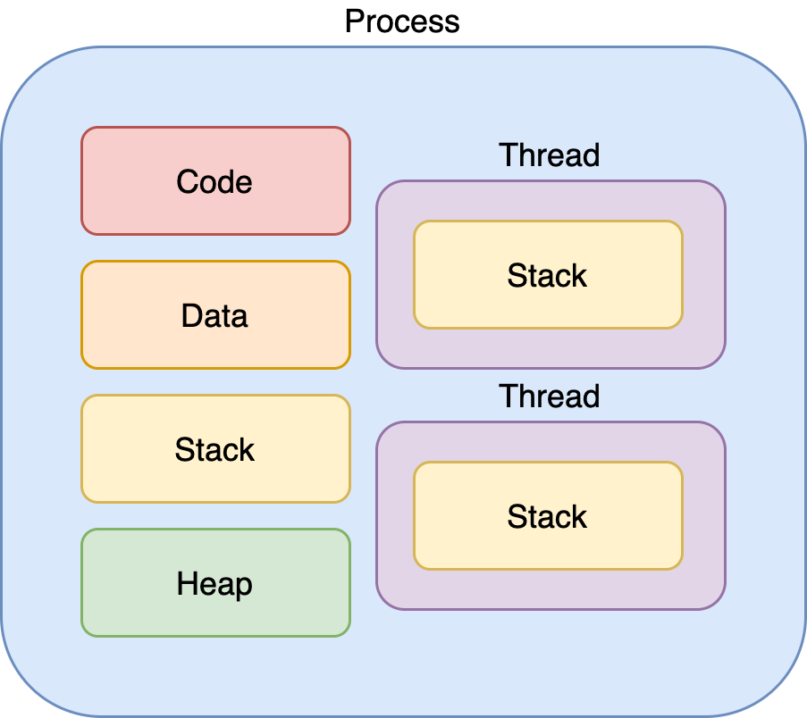

## 프로세스와 스레드

### `프로그램이 뭔가요?`

**프로그램은 컴퓨터에서 실행될 때 특정 작업을 수행하는 일련의 명령어들의 모음**

### `프로세스가 뭔가요?`

**프로세스는 프로그램을 구동해 프로그램과 프로그램의 상태가 메모리 상에서 실행되는 작업**

### `스레드가 뭔가요?`

**스레드는 프로세스 내에서 실행되는 흐름의 단위를 말한다**

 <b>프로그램 > 프로세스 > 스레드</b> 📌

 

출처: [Link 🔥](https://velog.io/@raejoonee/%ED%94%84%EB%A1%9C%EC%84%B8%EC%8A%A4%EC%99%80-%EC%8A%A4%EB%A0%88%EB%93%9C%EC%9D%98-%EC%B0%A8%EC%9D%B4)

### 프로그램 > 프로세스 🔥

먼저 프로세스와 스레드에 대해 본격적으로 설명하기 전에 프로그램에 대해 추가 설명을 한다면.

**명령어들의 모음집일 뿐이지 프로그램 그 자체만으로 작업을 하는게 아니다**

작업을 하기 위해 프로그램을 실행을 하면.

프로그램을 실행하는 순간 해당 파일은 컴퓨터 메모리에 올라가게 되고, 이 상태를 동적인 상태라고 하며 이 상태의 프로그램을 **프로세스** 라고 한다.

**! 동적인 상태 :** 상황에 따라서 실시간으로 변함

#### 한 줄 요약: 프로그램은 코드 덩어리 파일, 그 프로그램을 실행한 게 프로세스

### 프로세스 > 스레드 🔥

예전에는 프로그램을 실행하는 흐름이 오직 프로세스 뿐이었다. 하지만 소프트웨어가 발전하면서 프로그램이 복잡한 동시 작업을 요구하면서 프로세스 하나만을 사용해서 프로그램을 실행하기는 벅차게 되었다.

쉽게 떠오르는 방법은, **"한 프로그램을 처리하기 위한 프로세스를 여러 개 만들면 되지 않을까?"** 생각이 들지만 이는 불가능한 일이었다. 왜냐하면 운영체제는 안전성을 위해서 프로세스는 서로의 메모리가 별도로 관리되어 생성시에 필요한 정보를 죄다 복사해야 되기에 생성 및 제거가 느리고 프로세스간 정보 교환이 매우 어렵다.

이러한 이유로 프로세스와는 다른 더 작은 실행 단위 개념이 필요하게 되었고, 이 개념이 바로 **스레드** 다.

스레드는 프로세스와 다르게 하나의 프로세스에서 스레드 간 메모리를 공유하며 작동한다.

스레드끼리 프로세스의 자원을 공유하면서 프로세스 실행 흐름의 일부가 되는 것이다.

### 프로세스와 스레드 작동 방식에 자세한 설명

운영체제는 프로세스가 메모리에 올라갈 때, 프로세스마다 각각 독립된 메모리 영역을 code / data / stack / heap의 형식으로 할당한다.

각각의 독립된 메모리 영역을 할당하기 때문에 프로세스는 또 다른 프로세스의 변수나 자료에 접근할 수 없다.

이와 다르게 스레드는 같은 프로세스 내의 메모리를 서로 공유할 수 있다.

프로세스가 할당받은 메모리 영역 내에서 stack 형식으로 할당된 메모리 영역을 따로 할당받고 나머지 code / data / heap 형식으로 할당된 메모리 영역을 공유한다.

따라서 각각의 스레드는 별도의 스택을 가지고 있지만 heap 메모리는 서로 읽고 쓸 수 있게 된다.

### 프로세스와 스레드의 차이

프로세스와 스레드는 개념의 범위부터 다르다. 스레드가 프로세스 안에 포함되어 있기 때문이다.

프로세스는 프로그램을 실행하는 순간 해당 파일이 컴퓨터 메모리에 올라가게 되고, 이 동적인 상태의 프로그램을 프로세스라 한다.

스레드는 프로세스를 구성하는 더 작은 실행 단위의 개념이다.

**프로세스는 메모리에 올라갈 때 운영체제로부터 독자적인 시스템 자원을 할당 받는 반면, 스레드는 프로세스 내부에서 다른 메모리 영역을 같은 프로세스내 다른 스레드와 공유한다.**

아주 쉽게 비유를 하자면  
**프로세스 :** 각각의 은행 지점  
**스레드 :** 은행 지점에 속한 고객 창구
