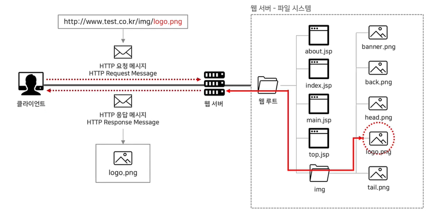
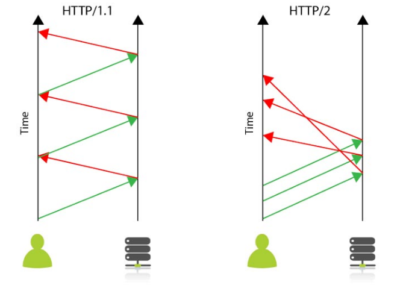

## 싱글스레드와 멀티스레드

### `HTTP란 무엇인가?`

Hyper Text Transfer Protocol의 약자로,

텍스트 기반의 통신 규약으로 인터넷에서 데이터를 주고 받을 수 있는 통신 규약이다.

이렇게 통신 규약을 정했기 때문에 모든 프로그램이 이 규약에 맞춰 개발하기 때문에 서로 정보를 교환할 수 있다.

### `HTTP 동작`

사용자가 브라우저를 통해 어떤 서비스를 URL를 통하거나 다른 방식으로

요청을 하면 서버에서는 요청 사항에 맞는 결과를 찾아 사용자에게 응답하는 형태로 동작한다.

요청 : 사용자 -> 서버
응답 : 서버 -> 사용자

### `HTTP 특징`

1. HTTP 메세지는 HTTP서버와 HTTP 클라이언트에 의해 해석된다.

2. TCP / IP를 이용하는 응용 프로토콜이다.

   > 컴퓨터간에 데이터를 전송할 수 있도록 하는 장치로 인터넷을 통해 원하는 데이터를 주고 받는 기능을 이용한 응용 프로토콜.

3. 연결 상태를 유지하지 않는 비연결성 통신 규약이다.

   > 이러한 단점을 해결하기 위해 Cookie와 Session이 등장했다.

4. HTTP는 연결을 유지하지 않는 통신 규약이기 때문에 요청 / 응답 방식으로 작동한다.

### `URL이란?` 🔥

Uniform Resource Locator의 약자로

통합 작업 지시자로 인터넷의 리소스를 가르키는 표준 명칭으로

서버의 자원을 요청할때 사용된다.

 

 

사용자 측에서 웹 서버에 자원을 요청하면 웹 서버는 파일 시스템 안에 해당하는 자원을 사용자 측으로 전송한다.

만약 자원을 지정하지 않고 www.test.co.kr 같은 사이트 도메인만 호출 한다면 웹 서버에 설정이 되어있는 기본 자원을 호출한다.

### `HTTP/1.1과 HTTP/2.0의 차이`

빠른 이해를 위해 아래 이미지를 한번 보자.

 

가장 큰 차이는 속도이다. 2.0은 헤더를 압축해서 보낼 수 있고, 한번의 연결로 동시에 에러메세지를 주고 받을 수 있다.

⚠️ HTTP 1.1의 특징

1. 연결 하나당 하나의 요청을 처리하도록 설계됨.

2. HOL(Head Of Line) 블로킹이 발생할 수 있다.

   > HOL 블로킹이란 네트워크에서 같은 큐에 있는 패킷이 첫번째 패킷에 의해 지연될 때 발생하는 성능 저하 현상

3. RTT(Round Trip Time) 증가.

   > 연결 하나에 요청 한 개를 처리하는 특성으로 인해, 매번 요청 별로 연결을 만들게 되어 불필요한 RTT 증가와 네트워크 지연을 초래해 성능 저하를 일으킨다.

4. 무거운 헤더 구조.
   > 매 요청마다 중복된 헤더 값을 전송하며, 서버 도메인에 관련된 쿠키 정보도 헤더에 포함되어 전송된다. 이러한 반복적인 헤더 전송, 쿠키 정보로 인해 크기가 증가한다.

### `HTTP/2.0`

엄밀히 말하면 HTTP/2.0은 HTTP/1.1을 재작성한 것이 아니라
프로토콜의 성능에 초점을 맞춰 수정한 버전이다.

실제 사용자가 느끼는 지연 시간, 네트워크, 서버 리소스 같은 성능 위주로 개선되었다.

⚠️ HTTP 2.0의 특징

1. 연결 한 개로 동시에 여러 개의 메세지를 주고 받을 수 있으며, 응답은 순서에 상관없이 주고 받는다.

2. 리소스 간의 의존 관계를 두고 우선 순위를 설정해 리소스 로드 문제를 해결한다.

3. 헤더 정보를 HPACK 방식으로 압축한다.

### `HTTPS는 HTTP랑 뭐가 다른가요?`

가장 큰 차이점은 **보안**이다.

HTTP 프로토콜은 서버에서 브라우저로 전송되는 정보가 암호화 되지 않는 점이다.

HTTPS는 SSL(보안 소켓 계층)을 사용해 서버와 브라우저 사이에 안전하게 암호화된 연결을 만들 수 있게

도와주며 데이터가 도난당하는 것을 막아준다.

 

아래 이미지를 참고하면 SSL을 쉽게 알 수 있다.

 

SSL 인증서는 쉽게 말해서 데이터를 암호로 바꾼다고 생각하면 된다.

이렇게 전송된 데이터는 중간에서 누가 훔쳐간다해도 데이터가 암호화 되어있기 때문이다.
