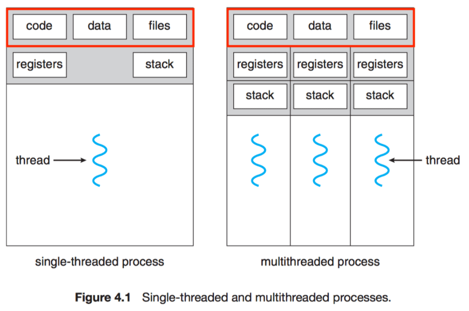
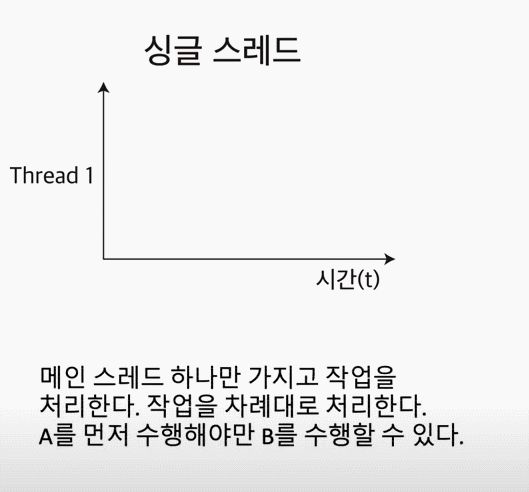
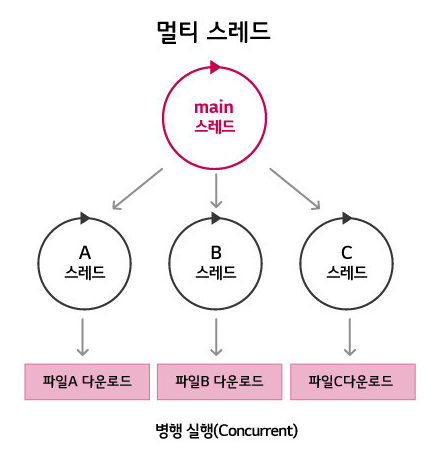
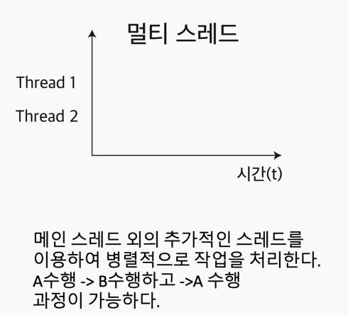

## 싱글스레드와 멀티스레드

### `싱글 스레드와 멀티스레드는 무엇인가?`

차이점을 보기 전에 아래 그림을 보자.

 

싱글 스레드와 멀티 스레드의 차이는 위 그림을 통해서 보는게 이해가 빠르다.

단순하게 생각한다면 **단일 스레드보다 멀티 스레드가 더 좋은게 아닌가?**

라는 생각이 들 수 있지만 간단한 문제가 아니다.

우리는 이것들이 무엇을 말하는지, 장단점이 무엇인지를 파악해보자.

 

### 싱글 스레드 🔥

 

하나의 프로세스에서 오직 하나의 스레드로만 실행한다.

그렇기 때문에 하나의 데이터를 담는 영역과 스택으로 표현이 가능하다.

👏 싱글 스레드의 장점

1. context switching 작업을 요구하지 않는다.

   > 문맥 교환은 여러 개의 프로세스가 하나의 프로세스를 공유할 때 발생하는 작업으로 많은 비용을 필요로한다.

2. 데이터 접근에 대한 동기화를 신경쓰지 않아도 된다.

   > 모든 스레드가 어떤 데이터에 동시에 접근하거나 같은 작업을 실행할 경우, 에러가 발생하거나 원하는 값이 나오지 않는다. 그래서 스레드들이 동시에 같은 데이터에 접근하지 못하도록 제어해야한다.

3. 단순히 cpu만을 사용하는 계산 작업이라면 싱글 스레드가 더 효율적이다.

   > 스레드 간에 작업전환(context switching)에 시간이 소요되기 때문에 cpu만을 사용하는 작업은 싱글 스레드가 더 빠르다.

4. 프로그래밍 난이도가 쉽고 cpu와 메모리를 적게 사용한다.

   > 멀티 스레드 모델은 프로그래밍 난이도가 높고 스레드 수 만큼 자원을 많이 사용한다.

⚠️ 싱글 스레드의 단점

1. 여러개의 cpu를 활용하지 못한다.

2. 연산량이 많은 작업의 경우, 해당 작업이 완료되어야 다른 작업을 수행할 수 있다.

   > 예를 들어 어떠한 데이터를 받는데 2초가 걸리고 받은 데이터를 DOM에 반영한다고 했을때 데이터를 받는 2초 동안 다른 작업을 수행할 수 없다.

3. 싱글 스레드 모델은 에러 처리를 못하는 경우 멈춘다.

   > 멀티 스레드 모델은 에러 발생시 새로운 스레드를 생성해 극복합니다.

 

### 멀티 스레드 🔥

 

 
멀티 스레드는 cpu의 최대 활용을 위해 스레드를 2개 이상 동시에 실행하는 기술이다.

 

 

이러한 작업은 context switching을 통해서 이뤄지는데 context switching은 하나의 스레드에서 다음 스레드로 이동을 하는 작업을 말한다.

> context switching이 빠르게 일어나면서, 사용자 입장에서는 프로그램이 동시에 수행되는것처럼 보인다.

👏 멀티 스레드의 장점

1. 응답성

   > 스레드가 중단되거나 긴 작업을 수행해도 프로그램은 계속해서 수행되므로 사용자에 대한 응답성은 증가한다.

2. 경제성

   > 프로세스내에서 데이터와 메모리를 공유하기 때문에 메모리 공간과 시스템 자원 소모가 줄어든다.

3. 멀티 프로세서 활용

   > 다중 cpu 구조에서 각각의 스레드가 다른 프로세서에서 병렬로 수행될 수 있어 병렬성이 증가한다.

⚠️ 멀티 스레드의 단점

1. context switching 및 동기화 등의 이유로 싱글 코어 멀티 스레딩은 스레드 생성 시간이 단일 스레드보다 느리다.

2. 공유하는 데이터를 동시에 접근하는 경우, 스레드는 데이터와 힙 영역을 공유하기 때문에 다른 스레드에서 사용중인 데이터에 접근해 의도치 않는 값을 읽어오거나 수정할 수 있다.

3. 멀티 스레딩을 하기 위해서는 운영체제의 지원이 필요하다.

4. 멀티 스레드 모델은 프로그래밍 난이도가 높다. 또한 스레드 수만큼 자원을 많이 사용한다.
